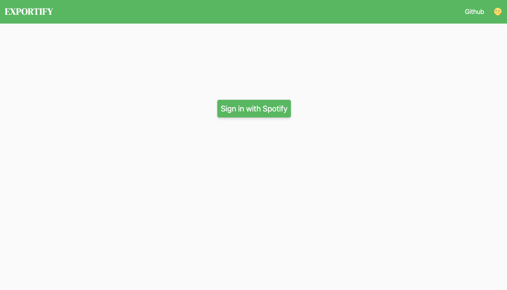

# Exportify

> Export your saved Spotify songs as Youtube videos (just links for now)

## Usage

You need a Spotify Developer account. [Go here](https://developer.spotify.com/dashboard/) to get one.

- Create a spotify-api app


- Name it whatever you want and click Create


- Edit the settings to add a callback URL (http://localhost:3000)


- Copy the tokens


- Now clone this repo and create an `.env` file

```bash
git clone https://github.com/pablopunk/exportify
cd exportify
touch .env
```

- Modify the `.env` to reflect the tokens you copied before from Spotify

```
SPOTIFY_CLIENT_ID=...
SPOTIFY_SECRET=...
```

- Now install the dependencies and run this project:

```
npm install
npm run dev
```

- Visit [localhost:3000](http://localhost:3000)



